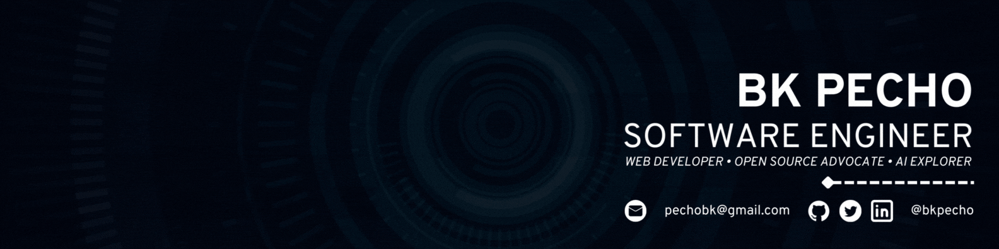

   
<!--    -->
  
  

<h2>☕ About Me</h2>

`Greetings,`

`I'm Bryan, a software engineer focused on crafting high-quality web experiences. I'm particularly passionate about contributing to open-source projects, as I believe in the power of collaborative development.`

`Outside of my professional pursuits, I enjoy playing guitar and spending time with my three dogs. These activities provide a welcome balance to my technical work.`

<h3>🖥️ Technologies and Tools</h3>
<table>
  <tr>
<td valign="top" width="50%">
  <h6>👨‍💻 Programming and Markup Languages</h6>
  <!-- Web Development Essentials -->
  
  
  
  <!-- JavaScript Ecosystem -->
  
  
  <!-- Server-side Languages -->
  
  
  <!-- Database Languages -->
</a>
  <!-- Markup and Documentation -->
  
  <!-- Educational Programming -->
</a>
</td>
<td valign="top" width="50%">
  <h6>🧰 Frameworks and Libraries</h6>
  <!-- React Ecosystem -->
  
  
  <!-- Vue Ecosystem -->
  
  
  <!-- CSS Frameworks and Preprocessors -->
  
  
  
  <!-- Static Site Generators -->
  
  <!-- Backend Frameworks -->
  
  
  <!-- Content Management Systems -->
  
</td>
  </tr>
  <tr>
     <td valign="top" width="50%">
      <h6>🗃️ Databases and Backend Services</h6>
      <!-- Relational Databases -->
      
      
      
      <!-- NoSQL Databases -->
      
      
      <!-- Backend as a Service (BaaS) -->
      
      
      
    </td>
   <td valign="top" width="50%">
  <h6>💻 Software and Tools</h6>
  <!-- IDEs and Code Editors -->
   
  
  
  <!-- Version Control -->
  
  
  
  <!-- API Testing Tools -->
  
  
  <!-- Development Environments -->
  
  <!-- Operating Systems -->
  
  
  
  
  
</td>
  </tr>
</table>

<!-- <h3>🚀 Featured Projects</h3>
<table>

  <tr>
      <td width="50%" valign="top">
      <h3 align="center">💻 Gadget Gizmo</h3>
         
        
         
        

  
  
      

        
<strong>Node.js, Express, MongoDB, React, Redux, React Bootstrap, Cloudinary, Paypal JS SDK</strong> -  Gadget Gizmo is a robust eCommerce platform developed with the MERN stack and Redux, offering a complete shopping cart experience and streamlined payment processing, including PayPal and credit/debit options.

    </td>
    <td width="50%" valign="top">
      <h3 align="center">🥂 Handaan</h3>
         
        
         
        

  
  
      

        
<strong>JavaScript, AOS, GLightbox, Isotope Layout, Swiper JS, HTML5, CSS3, & Bootstrap</strong> - Handaan is a delightful restaurant landing page with an elegant design, responsive interface, and smooth animations.

    </td>

  </tr>

   <tr>
     <td width="50%" valign="top">
      <h3 align="center">🍣 Sushi Delights</h3>
         
      
         
        

   
  
      

        
<strong>HTML5, CSS3, JavaScript, AOS, Vite, BEM</strong> - Sushi Delights is a responsive landing page for a sushi restaurant, featuring traditional and innovative sushi dishes with a touch of Japanese culinary excellence.

    </td>
    <td width="50%" valign="top">
      <h3 align="center">🏆 Nicotime-Out</h3>
         
        
         
        

  
  
      

        
<strong>Java, SQLite, Android Studio, Adobe XD, & Powtoon</strong> - Nicotime-Out is an Android application developed as an undergraduate thesis project to help smokers overcome their addiction. It offers a range of features and tools, leveraging mobile technology, to support users on their path to a smoke-free life.

    </td>
  </tr>
</table> -->

<h3>🚀 Nonstop Coding</h3>
<table>
  <tr>
     <td width="33%" valign="center">
      <h6>🐱‍👤 Codewars Stats Card</h6>
      
    </td>
    <td width="33%" valign="top">
      <h6>🏆 My GitHub Stats</h6>
      

        
<!--          -->
      
 
    </td>
    <td width="33%" valign="center">
      <h6>📚 LeetCode Stats Card</h6>
      

        
      

    </td>
  </tr>
</table>

<h3>🏷️ Holopin Badges</h3>

